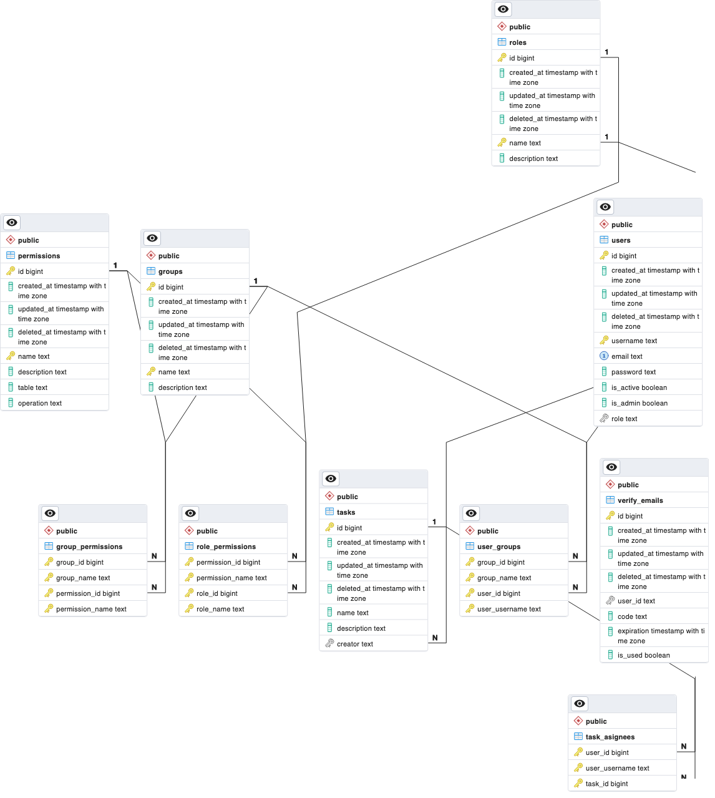

# RBAC Authentication Service



## About the Backend

A robust containerized task management system that prioritizes security and user access management. Users can register and authenticate securely, while also having the option to deactivate or delete their accounts, adhering to data retention policies. It offers role-based and group-based access management for tasks, ensuring that sensitive information remains protected. It ensures data integrity and user safety. Additionally, it provides seamless support for bulk upload using CSV files, guaranteeing that relationships between users and tasks are accurately preserved.

## Key Features
- Authentication and Authorization
- Custom Role-based and Group-based access management
- Secure Bulk Uploads from CSV files

## Tech Stack
- Go
- Gin
- Gorm
- PostgreSQL
- Docker

## Getting Started

### Prerequisites

- Install [Go](https://go.dev/doc/install)
- Install [PostgreSQL](https://www.postgresql.org/download/)

### Setup

- Clone the repo.

    ```shell
    git clone https://github.com/guptaharsh13/rback-auth-service
    ```

- Change into the directory.

    ```shell
    cd rback-auth-service
    ```

- **Environment Variables**

  ```shell
  touch .env
  ```

  **For running this project successfully you'll need to create a `.env` file and store your PostgreSQL there like [`.env.sample`](https://github.com/guptaharsh13/rback-auth-service/blob/master/.env.sample).**

## Usage

### Local Run

```shell
go mod tidy
go run cmd/*.go 
```

### Docker Run

```shell
docker-compose up --build -d
```

### Create Admin User
```shell
go run cmd/*.go create admin <username> <email> <password>
```


Now, may access the app on http://localhost:PORT

PORT: You may have optionally specified in the .env file

## API documentation

<a href="https://documenter.getpostman.com/view/11144664/2s946mZ9eL" target="_blank">
    
</a>

## Contact

Harsh Gupta - hg242322@gmail.com

GitHub Link: [https://github.com/guptaharsh13](https://github.com/guptaharsh13)

<p align="center">Made with ❤ by Harsh Gupta</p>
